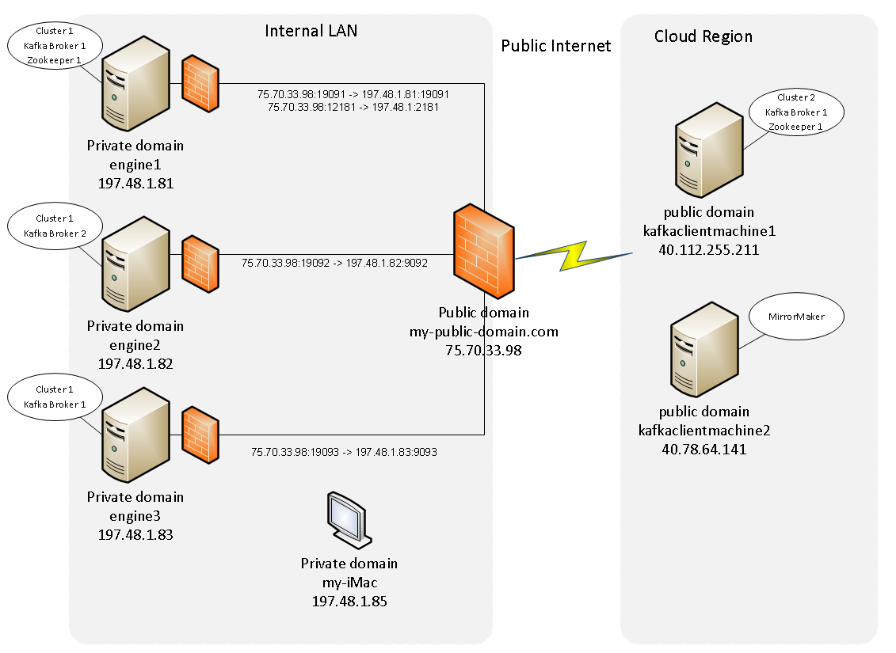

# Kafka-proxied
This project provides scripts and configuration details required to get a multi-node Kafka Cluster running and make it available over a public dns to producers and consumers and using Kafka MirrorMaker to replicate topic data to a remote Kafka Cluster. 

## Exposing Kafka Cluster through Public Network Gateway
So let's design a Kafka system topology... 

Pictured below is a typical Kafka setup sitting on an internal network with Kafka running over a multi-node cluster distributed across three machines. The first machine `engine1` will be running both Zookeeper and a Kafka broker with broker id `1`. The second and third machines `engine2` and `engine3` are running Kafka brokers identified with broker ids `2` and `3`. All machines are running on the sub-net in the `197.48.1.*` group and are port-mapped from a firewall sitting at the LAN gateway. The LAN gateway has the domain name `my-public-domain` and is resolveable by Internet dns to ip `75.70.33.98`. Notice that the external ports are different than the internal ones, that is those that kafka will be running on based on their machine ip. 

Outside the LAN are two machines sitting in the cloud that have reliable internet accessible ip addreses and domain names as well. These don't have to be cloud machines in fact they could be any machines sitting outside the LAN but the cloud scenario is a likely one. The one machine `Kafkaclientmachine1` will also be running a small single-node Kafka cluster that has Kafka topic data being replicated to it through Kafka MirrorMaker. Both cloud machines `Kafkaclientmachine1` and `Kafkaclientmachine2` are capapble of acting as Kafka consumers, producers or can run MirrorMaker processes. 

For security the kafka machines `engine1` `engine2` and `engine3` will also be running their own firewall and only allow communication to kafka brokers and zookeepers from the internal network and to the specific ips of the cloud machines. 

**While this setup may seem typical, there are a few special considerations and some not so well known nor well  documented configuration settings and OS network configuration decisions to be made in order to make the internal Kafka cluster work both inside and outside the LAN**. By the time you get through this you will understand what has to be considered and how to configure Kafka and even the host machines themselves in order to make it all work. We are trying to avoid the frustration "LEADER NOT AVAILABLE" flying around and not knowing what the problems are or how to fix them. 

While this configuration is about setting up and configuration kafka on hardware machines, it is applicable for VMs and for Dockerized Kafka process as well. Dockerization of Kafka has some additional considerations so that will sit outside the scope of this effort for now but will be added in later. A Vagrantfile is provided in the source code here and available to you to stand up three Vagrant managed VirtualBox VMs if you don't have access to three physical machines. The only special consideration there are some special Vagrant/VirtualBox network settings which again, may be outside the scope of this effort right now should you try this route and run into problems. 

Just a **warning** that you must be somewhat comfortable with Linux, Linux Networking, Kafka to complete this setup. It is not intended to be a guide for Windows and while it is all Linux, it is ready to use on RPM based Linux distros like Redhat and CentOS (not tested on Fedora). Modifications are required (and welcomed to be added to the project) if you intend on using other Linux distros like Ubuntu.  

**Note:** Check Reference Section below for more information on Kafka, Kafka-MirroMaker, Vagrant, and Docker



### Internal Network Kafka Cluster Configuration
So let's step through the proces of setting this all up and making it work correctly. While Kafka is fairly well documented on the [Apache Kafka website](https://kafka.apache.org), and on the major Hadoop distributions like [Cloudera](https://www.cloudera.com/documentation/kafka/latest/topics/kafka.html) and [Hortonworks](https://hortonworks.com/apache/kafka/) it can be a lot to take in all once and more importantly to set up consistently when you want to repeat the process over and over. The intent of this project is to provide a consistent set of scripts (bash) to configure, stand up and tear down Kafka. This can be quite helpful as first steps to setting up production Kafka clusters until things are working. Rather than use other DevOps provisioning tools like Ansible, or perhaps Chef or Puppet, the choice was made to do this using bash scripts as that is available on any linux machine and in many cases for what we are setting up there would be more work to make those tools do the job completely as we are doing more than just install things. **Currently all bash scripts assume an RPM linux distro is being used so if you want to use a Debian distro like Ubunto, you will have to modify appropriately**.


#### engine1 (runs Kafka-Zookeeper and Kafka-Broker-1 processes)
This node in the cluster will run a Zookeper instance and a Broker instance. 
This shows the configurations for each process

##### Kafka-zookeeper-1-config.properties (no special requirements)
```
dataDir=/tmp/zookeeper
clientPort=2181
maxClientCnxns=0
```

##### Kafka-broker-1-config.properties (required to expose public cluster details)
```
broker.id=1
listeners=PLAINTEXT://:9091
advertised.listeners=PLAINTEXT://my-public-domain.com:9091
num.network.threads=3
num.io.threads=8
socket.send.buffer.bytes=102400
socket.receive.buffer.bytes=102400
socket.request.max.bytes=104857600
message.max.bytes=1048576
log.segment.bytes=1073741824
log.dirs=/tmp/Kafka-logs/1
num.partitions=1
num.recovery.threads.per.data.dir=1
log.retention.hours=1
log.retention.bytes=26214400
log.retention.check.interval.ms=300000
zookeeper.connect=my-public-domain.com:2181
zookeeper.connection.timeout.ms=16000
```

##### /etc/hosts (required dns resolution to the public cluster nodes)

```
127.0.0.1   localhost localhost.localdomain localhost4 localhost4.localdomain4
::1         localhost localhost.localdomain localhost6 localhost6.localdomain6

197.48.1.81 engine1 engine1.my-public-domain.com my-public-domain.com
197.48.1.82 engine2 engine2.my-public-domain.com
197.48.1.83 engine3 engine3.my-public-domain.com
197.48.1.85 Peters-iMac iMac Peters-iMac.hsd1.co.comcast.net
197.48.1.88 Peters-MBP MBP Peters-MBP.hsd1.co.comcast.net
```

##### firewall config (inbound rules need to allow for external/internal connections)

```
public (active)
  target: default
  icmp-block-inversion: no
  interfaces: eno1
  sources: 
  services: dhcpv6-client nfs ssh
  ports: 2222/tcp 5800/tcp 9889/tcp 9393/tcp 38080/tcp 8443/tcp 8000/tcp 5080/tcp 3389/tcp
  protocols: 
  masquerade: no
  forward-ports: 
  sourceports: 
  icmp-blocks: 
  rich rules: 
	rule family="ipv4" source address="197.48.1.82" port port="5001" protocol="udp" accept
	rule family="ipv4" source address="197.48.1.82" port port="5001" protocol="tcp" accept
	rule family="ipv4" source address="197.48.1.81" port port="19091-19093" protocol="tcp" accept
	rule family="ipv4" source address="197.48.1.81" port port="9091-9093" protocol="tcp" accept
	rule family="ipv4" source address="197.48.1.81" port port="2181" protocol="tcp" accept
	rule family="ipv4" source address="197.48.1.82" port port="2181" protocol="tcp" accept
	rule family="ipv4" source address="197.48.1.82" port port="9091-9093" protocol="tcp" accept
	rule family="ipv4" source address="197.48.1.83" port port="2181" protocol="tcp" accept
	rule family="ipv4" source address="197.48.1.83" port port="9091-9093" protocol="tcp" accept
	rule family="ipv4" source address="40.112.255.211" port port="9091-9093" protocol="tcp" accept
	rule family="ipv4" source address="40.112.255.211" port port="2181" protocol="tcp" accept
	rule family="ipv4" source address="40.78.64.141" port port="9091-9093" protocol="tcp" accept
	rule family="ipv4" source address="40.78.64.141" port port="2181" protocol="tcp" accept
```

- - -

#### engine2 (runs Kafka-Broker-2 process)
##### Kafka-broker-1-config.properties (required to expose public cluster details)

```
broker.id=2
listeners=PLAINTEXT://:9092
advertised.listeners=PLAINTEXT://my-public-domain.com:9092
num.network.threads=3
num.io.threads=8
socket.send.buffer.bytes=102400
socket.receive.buffer.bytes=102400
socket.request.max.bytes=104857600
message.max.bytes=1048576
log.segment.bytes=1073741824
log.dirs=/tmp/Kafka-logs/2
num.partitions=1
num.recovery.threads.per.data.dir=1
log.retention.hours=1
log.retention.bytes=26214400
log.retention.check.interval.ms=300000
zookeeper.connect=my-public-domain.com:2181
zookeeper.connection.timeout.ms=16000

```

##### /etc/hosts (required dns resolution to the public cluster nodes)

```
127.0.0.1   localhost localhost.localdomain localhost4 localhost4.localdomain4
::1         localhost localhost.localdomain localhost6 localhost6.localdomain6

197.48.1.81 engine1 engine1.my-public-domain.com 
197.48.1.82 engine2 engine2.my-public-domain.com my-public-domain.com
197.48.1.83 engine3 engine3.my-public-domain.com
```

##### firewall config (inbound rules need to allow for external/internal connections)
```
public (active)
  target: default
  icmp-block-inversion: no
  interfaces: eno1
  sources: 
  services: dhcpv6-client ssh
  ports: 9000/tcp
  protocols: 
  masquerade: no
  forward-ports: 
  sourceports: 
  icmp-blocks: 
  rich rules: 
	rule family="ipv4" source address="197.48.1.81" port port="9091-9093" protocol="tcp" accept
	rule family="ipv4" source address="40.112.255.211" port port="9091-9093" protocol="tcp" accept
	rule family="ipv4" source address="40.78.64.141" port port="9091-9093" protocol="tcp" accept
	rule family="ipv4" source address="197.48.1.82" port port="9091-9093" protocol="tcp" accept
	rule family="ipv4" source address="197.48.1.83" port port="9091-9093" protocol="tcp" accept
	rule family="ipv4" source address="197.48.1.85" port port="2181" protocol="tcp" accept
	rule family="ipv4" source address="197.48.1.85" port port="9091-9093" protocol="tcp" accept
	rule family="ipv4" source address="197.48.1.141" port port="2181" protocol="tcp" accept
	rule family="ipv4" source address="197.48.1.141" port port="9091-9093" protocol="tcp" accept

```

- - -

#### engine3 (runs Kafka-Broker-3 process)

##### Kafka-broker-1-config.properties (required to expose public cluster details)

```
broker.id=3
listeners=PLAINTEXT://:9093
advertised.listeners=PLAINTEXT://my-public-domain.com:9093
num.network.threads=3
num.io.threads=8
socket.send.buffer.bytes=102400
socket.receive.buffer.bytes=102400
socket.request.max.bytes=104857600
message.max.bytes=1048576
log.segment.bytes=1073741824
log.dirs=/tmp/Kafka-logs/3
num.partitions=1
num.recovery.threads.per.data.dir=1
log.retention.hours=1
log.retention.bytes=26214400
log.retention.check.interval.ms=300000
zookeeper.connect=my-public-domain.com:2181
zookeeper.connection.timeout.ms=16000
```

##### /etc/hosts (required dns resolution to the public cluster nodes)

```
127.0.0.1   localhost localhost.localdomain localhost4 localhost4.localdomain4
::1         localhost localhost.localdomain localhost6 localhost6.localdomain6

197.48.1.81 engine1 engine1.my-public-domain.com 
197.48.1.82 engine2 engine2.my-public-domain.com
197.48.1.83 engine3 engine3.my-public-domain.com my-public-domain.com
```

##### firewall config (inbound rules need to allow for external/internal connections)

```
public (active)
  target: default
  icmp-block-inversion: no
  interfaces: wlo1
  sources: 
  services: dhcpv6-client ssh
  ports: 
  protocols: 
  masquerade: no
  forward-ports: 
  sourceports: 
  icmp-blocks: 
  rich rules: 
	rule family="ipv4" source address="40.112.255.211" port port="9091-9093" protocol="tcp" accept
	rule family="ipv4" source address="40.112.255.211" port port="2181" protocol="tcp" accept
	rule family="ipv4" source address="40.78.64.141" port port="9091-9093" protocol="tcp" accept
	rule family="ipv4" source address="40.78.64.141" port port="2181" protocol="tcp" accept
	rule family="ipv4" source address="197.48.1.81" port port="9091-9093" protocol="tcp" accept
	rule family="ipv4" source address="197.48.1.81" port port="2181" protocol="tcp" accept
	rule family="ipv4" source address="197.48.1.82" port port="2181" protocol="tcp" accept
	rule family="ipv4" source address="197.48.1.82" port port="9091-9093" protocol="tcp" accept
	rule family="ipv4" source address="197.48.1.83" port port="2181" protocol="tcp" accept
	rule family="ipv4" source address="197.48.1.83" port port="9091-9093" protocol="tcp" accept
```

- - -
#### Peters-iMac
- ip must be allow to connect on each node

### External Network Kafka Clients (consumer and producer)

#### hospitalityhertzpocnode1 (run the Kafka console producer)
```bash
[petergdoyle@hospitalityhertzpocnode1 scripts]$ ./start_Kafka_console_producer.sh 
Enter a Kafka broker server: my-public-domain.com:9091
Enter the topic name: Kafka-simple-topic-1
/usr/Kafka/default/bin/Kafka-console-producer.sh --broker-list my-public-domain.com:9091 --topic Kafka-simple-topic-1
message10
message11
message12
```

- - -
#### hospitalityhertzpocnode0 (run the Kafka console consumer)
```bash
[petergdoyle@hospitalityhertzpocnode0 ~]$ /usr/Kafka/default/bin/Kafka-console-consumer.sh --new-consumer --bootstrap-server my-public-domain.com:9091 --topic Kafka-simple-topic-1 --from-beginning
[2017-08-14 15:28:30,260] INFO ConsumerConfig values: 
	auto.commit.interval.ms = 5000
	auto.offset.reset = earliest
	bootstrap.servers = [my-public-domain.com:9091]
	check.crcs = true
	client.id = 
	connections.max.idle.ms = 540000
	enable.auto.commit = true
	exclude.internal.topics = true
	fetch.max.bytes = 52428800
	fetch.max.wait.ms = 500
	fetch.min.bytes = 1
	group.id = console-consumer-63744
	heartbeat.interval.ms = 3000
	interceptor.classes = null
	key.deserializer = class org.apache.Kafka.common.serialization.ByteArrayDeserializer
	max.partition.fetch.bytes = 1048576
	max.poll.interval.ms = 300000
	max.poll.records = 500
	metadata.max.age.ms = 300000
	metric.reporters = []
	metrics.num.samples = 2
	metrics.sample.window.ms = 30000
	partition.assignment.strategy = [class org.apache.Kafka.clients.consumer.RangeAssignor]
	receive.buffer.bytes = 65536
	reconnect.backoff.ms = 50
	request.timeout.ms = 305000
	retry.backoff.ms = 100
	sasl.kerberos.kinit.cmd = /usr/bin/kinit
	sasl.kerberos.min.time.before.relogin = 60000
	sasl.kerberos.service.name = null
	sasl.kerberos.ticket.renew.jitter = 0.05
	sasl.kerberos.ticket.renew.window.factor = 0.8
	sasl.mechanism = GSSAPI
	security.protocol = PLAINTEXT
	send.buffer.bytes = 131072
	session.timeout.ms = 10000
	ssl.cipher.suites = null
	ssl.enabled.protocols = [TLSv1.2, TLSv1.1, TLSv1]
	ssl.endpoint.identification.algorithm = null
	ssl.key.password = null
	ssl.keymanager.algorithm = SunX509
	ssl.keystore.location = null
	ssl.keystore.password = null
	ssl.keystore.type = JKS
	ssl.protocol = TLS
	ssl.provider = null
	ssl.secure.random.implementation = null
	ssl.trustmanager.algorithm = PKIX
	ssl.truststore.location = null
	ssl.truststore.password = null
	ssl.truststore.type = JKS
	value.deserializer = class org.apache.Kafka.common.serialization.ByteArrayDeserializer
 (org.apache.Kafka.clients.consumer.ConsumerConfig)
[2017-08-14 15:28:30,265] INFO ConsumerConfig values: 
	auto.commit.interval.ms = 5000
	auto.offset.reset = earliest
	bootstrap.servers = [my-public-domain.com:9091]
	check.crcs = true
	client.id = consumer-1
	connections.max.idle.ms = 540000
	enable.auto.commit = true
	exclude.internal.topics = true
	fetch.max.bytes = 52428800
	fetch.max.wait.ms = 500
	fetch.min.bytes = 1
	group.id = console-consumer-63744
	heartbeat.interval.ms = 3000
	interceptor.classes = null
	key.deserializer = class org.apache.Kafka.common.serialization.ByteArrayDeserializer
	max.partition.fetch.bytes = 1048576
	max.poll.interval.ms = 300000
	max.poll.records = 500
	metadata.max.age.ms = 300000
	metric.reporters = []
	metrics.num.samples = 2
	metrics.sample.window.ms = 30000
	partition.assignment.strategy = [class org.apache.Kafka.clients.consumer.RangeAssignor]
	receive.buffer.bytes = 65536
	reconnect.backoff.ms = 50
	request.timeout.ms = 305000
	retry.backoff.ms = 100
	sasl.kerberos.kinit.cmd = /usr/bin/kinit
	sasl.kerberos.min.time.before.relogin = 60000
	sasl.kerberos.service.name = null
	sasl.kerberos.ticket.renew.jitter = 0.05
	sasl.kerberos.ticket.renew.window.factor = 0.8
	sasl.mechanism = GSSAPI
	security.protocol = PLAINTEXT
	send.buffer.bytes = 131072
	session.timeout.ms = 10000
	ssl.cipher.suites = null
	ssl.enabled.protocols = [TLSv1.2, TLSv1.1, TLSv1]
	ssl.endpoint.identification.algorithm = null
	ssl.key.password = null
	ssl.keymanager.algorithm = SunX509
	ssl.keystore.location = null
	ssl.keystore.password = null
	ssl.keystore.type = JKS
	ssl.protocol = TLS
	ssl.provider = null
	ssl.secure.random.implementation = null
	ssl.trustmanager.algorithm = PKIX
	ssl.truststore.location = null
	ssl.truststore.password = null
	ssl.truststore.type = JKS
	value.deserializer = class org.apache.Kafka.common.serialization.ByteArrayDeserializer
 (org.apache.Kafka.clients.consumer.ConsumerConfig)
[2017-08-14 15:28:30,476] INFO Kafka version : 0.10.1.1 (org.apache.Kafka.common.utils.AppInfoParser)
[2017-08-14 15:28:30,476] INFO Kafka commitId : f10ef2720b03b247 (org.apache.Kafka.common.utils.AppInfoParser)
[2017-08-14 15:28:30,661] INFO Discovered coordinator my-public-domain.com:9091 (id: 2147483646 rack: null) for group console-consumer-63744. (org.apache.Kafka.clients.consumer.internals.AbstractCoordinator)
[2017-08-14 15:28:30,662] INFO Revoking previously assigned partitions [] for group console-consumer-63744 (org.apache.Kafka.clients.consumer.internals.ConsumerCoordinator)
[2017-08-14 15:28:30,662] INFO (Re-)joining group console-consumer-63744 (org.apache.Kafka.clients.consumer.internals.AbstractCoordinator)
[2017-08-14 15:28:30,786] INFO Successfully joined group console-consumer-63744 with generation 1 (org.apache.Kafka.clients.consumer.internals.AbstractCoordinator)
[2017-08-14 15:28:30,786] INFO Setting newly assigned partitions [Kafka-simple-topic-1-0] for group console-consumer-63744 (org.apache.Kafka.clients.consumer.internals.ConsumerCoordinator)
message10
message11
message12

```

- - -


## Notes:

- a proxy may be required if the port on the host machine (engine1, 2, 3) cannot be mapped directly to the same port 

## References:

**Note: **For more information on Kafka MirorMaker please refer to the documentation. You can get some of that here https://cwiki.apache.org/confluence/pages/viewpage.action?pageId=27846330 and here https://docs.microsoft.com/en-us/azure/hdinsight/hdinsight-apache-Kafka-mirroring if you are interested in mirroring Kafka data up to azure 