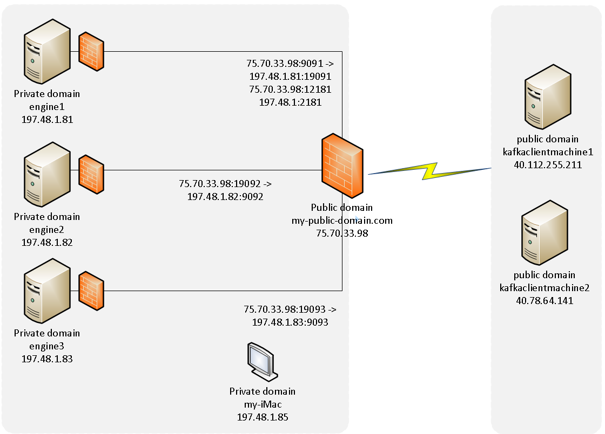

# kafka-proxied
## Exposing Kafka Cluster through Public Network Gateway





###Internal Network Kafka Cluster Configuration

####kafka_node_1 (runs Kafka-Zookeeper and Kafka-Broker-1 processes)
This node in the cluster will run a Zookeper instance and a Broker instance. 
This shows the configurations for each process

#####kafka-zookeeper-1-config.properties (no special requirements)
```
dataDir=/tmp/zookeeper
clientPort=2181
maxClientCnxns=0
```
#####kafka-broker-1-config.properties (required to expose public cluster details)
```
broker.id=1
listeners=PLAINTEXT://:9091
advertised.listeners=PLAINTEXT://cleverfishsoftware.com:9091
num.network.threads=3
num.io.threads=8
socket.send.buffer.bytes=102400
socket.receive.buffer.bytes=102400
socket.request.max.bytes=104857600
message.max.bytes=1048576
log.segment.bytes=1073741824
log.dirs=/tmp/kafka-logs/1
num.partitions=1
num.recovery.threads.per.data.dir=1
log.retention.hours=1
log.retention.bytes=26214400
log.retention.check.interval.ms=300000
zookeeper.connect=cleverfishsoftware.com:2181
zookeeper.connection.timeout.ms=16000
```
#####/etc/hosts (required dns resolution to the public cluster nodes)
```
127.0.0.1   localhost localhost.localdomain localhost4 localhost4.localdomain4
::1         localhost localhost.localdomain localhost6 localhost6.localdomain6

192.168.1.81 engine1 engine1.cleverfishsoftware.com cleverfishsoftware.com
192.168.1.82 engine2 engine2.cleverfishsoftware.com
192.168.1.83 engine3 engine3.cleverfishsoftware.com
192.168.1.85 Peters-iMac iMac Peters-iMac.hsd1.co.comcast.net
192.168.1.88 Peters-MBP MBP Peters-MBP.hsd1.co.comcast.net

```
#####firewall config (inbound rules need to allow for external/internal connections)
```
public (active)
  target: default
  icmp-block-inversion: no
  interfaces: eno1
  sources: 
  services: dhcpv6-client nfs ssh
  ports: 2222/tcp 5800/tcp 9889/tcp 9393/tcp 38080/tcp 8443/tcp 8000/tcp 5080/tcp 3389/tcp
  protocols: 
  masquerade: no
  forward-ports: 
  sourceports: 
  icmp-blocks: 
  rich rules: 
	rule family="ipv4" source address="192.168.1.82" port port="5001" protocol="udp" accept
	rule family="ipv4" source address="192.168.1.82" port port="5001" protocol="tcp" accept
	rule family="ipv4" source address="192.168.1.81" port port="19091-19093" protocol="tcp" accept
	rule family="ipv4" source address="192.168.1.81" port port="9091-9093" protocol="tcp" accept
	rule family="ipv4" source address="192.168.1.81" port port="2181" protocol="tcp" accept
	rule family="ipv4" source address="192.168.1.82" port port="2181" protocol="tcp" accept
	rule family="ipv4" source address="192.168.1.82" port port="9091-9093" protocol="tcp" accept
	rule family="ipv4" source address="192.168.1.83" port port="2181" protocol="tcp" accept
	rule family="ipv4" source address="192.168.1.83" port port="9091-9093" protocol="tcp" accept
	rule family="ipv4" source address="40.112.255.211" port port="9091-9093" protocol="tcp" accept
	rule family="ipv4" source address="40.112.255.211" port port="2181" protocol="tcp" accept
	rule family="ipv4" source address="40.78.64.141" port port="9091-9093" protocol="tcp" accept
	rule family="ipv4" source address="40.78.64.141" port port="2181" protocol="tcp" accept
```
- - -

####kafka_node_2 (runs Kafka-Broker-2 process)
#####kafka-broker-1-config.properties (required to expose public cluster details)
```
broker.id=2
listeners=PLAINTEXT://:9092
advertised.listeners=PLAINTEXT://cleverfishsoftware.com:9092
num.network.threads=3
num.io.threads=8
socket.send.buffer.bytes=102400
socket.receive.buffer.bytes=102400
socket.request.max.bytes=104857600
message.max.bytes=1048576
log.segment.bytes=1073741824
log.dirs=/tmp/kafka-logs/2
num.partitions=1
num.recovery.threads.per.data.dir=1
log.retention.hours=1
log.retention.bytes=26214400
log.retention.check.interval.ms=300000
zookeeper.connect=cleverfishsoftware.com:2181
zookeeper.connection.timeout.ms=16000

```
#####/etc/hosts (required dns resolution to the public cluster nodes)
```

127.0.0.1   localhost localhost.localdomain localhost4 localhost4.localdomain4
::1         localhost localhost.localdomain localhost6 localhost6.localdomain6

##nextgen
192.168.1.81 engine1 engine1.cleverfishsoftware.com 
192.168.1.82 engine2 engine2.cleverfishsoftware.com cleverfishsoftware.com
192.168.1.83 engine3 engine3.cleverfishsoftware.com
```
#####firewall config (inbound rules need to allow for external/internal connections)
```
public (active)
  target: default
  icmp-block-inversion: no
  interfaces: eno1
  sources: 
  services: dhcpv6-client ssh
  ports: 9000/tcp
  protocols: 
  masquerade: no
  forward-ports: 
  sourceports: 
  icmp-blocks: 
  rich rules: 
	rule family="ipv4" source address="192.168.1.81" port port="9091-9093" protocol="tcp" accept
	rule family="ipv4" source address="40.112.255.211" port port="9091-9093" protocol="tcp" accept
	rule family="ipv4" source address="40.78.64.141" port port="9091-9093" protocol="tcp" accept
	rule family="ipv4" source address="192.168.1.82" port port="9091-9093" protocol="tcp" accept
	rule family="ipv4" source address="192.168.1.83" port port="9091-9093" protocol="tcp" accept
	rule family="ipv4" source address="192.168.1.85" port port="2181" protocol="tcp" accept
	rule family="ipv4" source address="192.168.1.85" port port="9091-9093" protocol="tcp" accept
	rule family="ipv4" source address="192.168.1.141" port port="2181" protocol="tcp" accept
	rule family="ipv4" source address="192.168.1.141" port port="9091-9093" protocol="tcp" accept

```
- - -
####kafka_node_3 (runs Kafka-Broker-3 process)
#####kafka-broker-1-config.properties (required to expose public cluster details)
```
broker.id=3
listeners=PLAINTEXT://:9093
advertised.listeners=PLAINTEXT://cleverfishsoftware.com:9093
num.network.threads=3
num.io.threads=8
socket.send.buffer.bytes=102400
socket.receive.buffer.bytes=102400
socket.request.max.bytes=104857600
message.max.bytes=1048576
log.segment.bytes=1073741824
log.dirs=/tmp/kafka-logs/3
num.partitions=1
num.recovery.threads.per.data.dir=1
log.retention.hours=1
log.retention.bytes=26214400
log.retention.check.interval.ms=300000
zookeeper.connect=cleverfishsoftware.com:2181
zookeeper.connection.timeout.ms=16000
```
#####/etc/hosts (required dns resolution to the public cluster nodes)
127.0.0.1   localhost localhost.localdomain localhost4 localhost4.localdomain4
::1         localhost localhost.localdomain localhost6 localhost6.localdomain6

##nextgen
192.168.1.81 engine1 engine1.cleverfishsoftware.com 
192.168.1.82 engine2 engine2.cleverfishsoftware.com
192.168.1.83 engine3 engine3.cleverfishsoftware.com cleverfishsoftware.com
#####firewall config (inbound rules need to allow for external/internal connections)
```
public (active)
  target: default
  icmp-block-inversion: no
  interfaces: wlo1
  sources: 
  services: dhcpv6-client ssh
  ports: 
  protocols: 
  masquerade: no
  forward-ports: 
  sourceports: 
  icmp-blocks: 
  rich rules: 
	rule family="ipv4" source address="40.112.255.211" port port="9091-9093" protocol="tcp" accept
	rule family="ipv4" source address="40.112.255.211" port port="2181" protocol="tcp" accept
	rule family="ipv4" source address="40.78.64.141" port port="9091-9093" protocol="tcp" accept
	rule family="ipv4" source address="40.78.64.141" port port="2181" protocol="tcp" accept
	rule family="ipv4" source address="192.168.1.81" port port="9091-9093" protocol="tcp" accept
	rule family="ipv4" source address="192.168.1.81" port port="2181" protocol="tcp" accept
	rule family="ipv4" source address="192.168.1.82" port port="2181" protocol="tcp" accept
	rule family="ipv4" source address="192.168.1.82" port port="9091-9093" protocol="tcp" accept
	rule family="ipv4" source address="192.168.1.83" port port="2181" protocol="tcp" accept
	rule family="ipv4" source address="192.168.1.83" port port="9091-9093" protocol="tcp" accept
```
- - -
####Peters-iMac
- ip must be allow to connect on each node
- - -
- - -


###External Network Kafka Clients (consumer and producer)
- - -

####hostpitalitykafkapocnode0
- - -

####hostpitalitykafkapocnode1
- - -
- - -

##Notes:

